# cc-mini 架构总览

## 1. Agent 架构类型

**类型：流式 ReAct（Reasoning + Acting）循环**

cc-mini 实现了一个经典的 **ReAct Agent 模式**，其核心特征如下：

- LLM 自主决策是否调用工具（无外部路由器、无显式规划器）
- 工具执行结果回注到对话上下文，驱动下一轮推理
- 循环持续进行，直到 LLM 不再发出工具调用（即任务完成）
- 全程流式输出，文本 chunk 实时抵达终端

这是一个 **单 Agent + 可选多 Worker 协调器** 的混合架构：默认为单 Agent ReAct，启用 `--coordinator` 后升级为 Coordinator-Worker 多 Agent 模式。

---

## 2. Harness 工程

Harness（运行时外壳）的职责是将 LLM 能力包装为可交互、可持久化、可扩展的 Agent 应用。cc-mini 的 Harness 工程包含以下几个层次：

| 层次 | 职责 | 关键文件 |
|------|------|----------|
| **入口层** | CLI 参数解析、配置加载、模式选择（REPL / 一次性） | `main.py` |
| **编排层** | ReAct 循环、事件流生成、重试逻辑 | `engine.py` |
| **LLM 抽象层** | 多 Provider 适配（Anthropic / OpenAI）、流式处理 | `llm.py` |
| **工具层** | 工具注册、Schema 生成、权限校验、执行 | `tools/`, `permissions.py` |
| **上下文层** | System Prompt 组装、动态环境注入 | `context.py` |
| **记忆层** | 会话持久化、跨会话记忆、自动整合 | `session.py`, `memory.py` |
| **压缩层** | 上下文窗口管理、历史摘要 | `compact.py` |
| **协调层** | 后台 Worker 管理、任务分发与通知 | `coordinator.py`, `worker_manager.py` |
| **扩展层** | 技能系统、沙箱隔离、伴侣宠物 | `skills.py`, `sandbox/`, `buddy/` |

**配置优先级**：CLI 参数 > 环境变量 > TOML 配置文件 > 内置默认值

---

## 3. 核心运行时组件

### 3.1 Engine（引擎）— `engine.py`

ReAct 循环的编排者。`submit()` 方法是整个 Agent 的心脏：

- 将用户输入追加到消息历史
- 循环调用 LLM → 解析工具调用 → 执行工具 → 回注结果
- 以 Generator 模式 yield 事件流：`text`、`waiting`、`tool_call`、`tool_result`、`usage`、`error`
- 内置指数退避重试（3 次，间隔 1s/3s/10s）

### 3.2 LLMClient — `llm.py`

LLM 通信抽象层：

- 统一接口：`stream_messages()` / `create_message()`
- Provider 适配：`_AnthropicStream` / `_OpenAIStream`
- 消息格式转换、工具 Schema 转换、用量追踪

### 3.3 Tool System（工具系统）— `tools/`

基于抽象基类 `Tool` 的插件式工具体系：

| 工具 | 类型 | 职责 |
|------|------|------|
| Read | 只读 | 读取文件内容 |
| Glob | 只读 | 文件模式匹配搜索 |
| Grep | 只读 | 内容正则搜索 |
| Edit | 写入 | 字符串替换编辑 |
| Write | 写入 | 创建/覆盖文件 |
| Bash | 写入 | 执行 Shell 命令 |
| Agent | 协调 | 启动后台 Worker |
| SendMessage | 协调 | 向 Worker 发送消息 |
| TaskStop | 协调 | 终止 Worker |

### 3.4 PermissionChecker（权限检查器）— `permissions.py`

工具执行的守门人：

- 只读工具自动放行
- 写入工具需用户确认（y/n/always）
- `--auto-approve` 模式跳过所有确认
- 沙箱模式下的 Bash 命令可自动放行

### 3.5 SessionStore（会话存储）— `session.py`

会话持久化：

- JSONL 追加写入（每条消息一行）
- 元数据文件（标题、时间戳、消息计数）
- 按工作目录组织，支持 `/resume` 恢复

### 3.6 KAIROS Memory（记忆系统）— `memory.py`

跨会话长期记忆：

- **Daily Logs**：按日追加的时间戳日志
- **MEMORY.md**：经整合后的结构化记忆索引
- **Dream 整合**：定时/手动触发，用 LLM 总结所有日志并更新索引
- **文件锁**：防止多进程并发整合

### 3.7 CompactService（压缩服务）— `compact.py`

上下文窗口管理：

- 自动检测 token 用量逼近窗口上限
- 用 LLM 生成结构化摘要替换旧消息
- 保留最近 6 条消息 / 10k tokens 的上下文

### 3.8 Context Builder（上下文构建器）— `context.py`

动态组装 System Prompt：

```
基础指令 + 环境信息(日期/CWD/Git) + CLAUDE.md + 记忆摘要 + 技能目录 + 协调器上下文
```

---

## 4. Agent 生命周期

从用户输入到最终输出的完整流程：

```
用户输入
  │
  ├─ 解析：斜杠命令? 图片引用? Shell 快捷方式? 普通文本?
  │
  ├─ 路由
  │   ├─ /command  → 命令处理器（compact/resume/dream/clear...）
  │   ├─ !command  → subprocess 直接执行
  │   └─ 普通文本  → engine.submit()
  │
  ├─ Engine ReAct 循环
  │   │
  │   ├─ [1] 追加用户消息到历史 & 持久化
  │   │
  │   └─ [2] WHILE True:
  │       │
  │       ├─ 调用 LLM（流式）
  │       │   ├─ yield ("text", chunk)  → 实时显示
  │       │   └─ 收集 tool_use blocks
  │       │
  │       ├─ 追加 assistant 消息到历史
  │       │
  │       ├─ 有 tool_use?
  │       │   ├─ YES → 逐个执行工具
  │       │   │   ├─ 权限检查
  │       │   │   ├─ tool.execute()
  │       │   │   ├─ yield ("tool_call"/"tool_result", ...)
  │       │   │   └─ 收集结果 → 追加为 user 消息
  │       │   │   └─ continue（回到循环顶部）
  │       │   │
  │       │   └─ NO → break（任务完成）
  │
  ├─ 后处理（仅 REPL 模式）
  │   ├─ 提取 <memory> 标签 → 追加到 Daily Log
  │   ├─ 检查是否需要自动压缩
  │   ├─ 触发伴侣宠物观察器
  │   └─ 检查是否需要自动 Dream 整合
  │
  └─ 就绪，等待下一次用户输入
```

---

## 5. LLM / 记忆 / 工具 / 控制循环 协作机制

### 协作关系

```
┌─────────────────────────────────────────────────────────┐
│                    Control Loop (Engine)                 │
│                                                         │
│   ┌──────────┐    消息 + System Prompt    ┌──────────┐  │
│   │          │ ──────────────────────────→ │          │  │
│   │  Memory  │                            │   LLM    │  │
│   │          │ ←── <memory> 标签提取 ──── │          │  │
│   └──────────┘                            └────┬─────┘  │
│        │                                       │        │
│   注入 System Prompt                    tool_use 决策   │
│        │                                       │        │
│        ▼                                       ▼        │
│   ┌──────────┐                          ┌──────────┐    │
│   │ Context  │                          │  Tools   │    │
│   │ Builder  │                          │ Registry │    │
│   └──────────┘                          └──────────┘    │
│                                                         │
└─────────────────────────────────────────────────────────┘
```

### 详细说明

**LLM → 工具**：LLM 在每轮响应中自主决定是否调用工具。它看到所有工具的 JSON Schema，基于当前任务和上下文选择合适的工具及参数。无需外部路由器——决策权完全在 LLM。

**工具 → 控制循环**：工具执行结果以 `tool_result` 消息形式回注到对话历史。控制循环据此决定是否继续（有新的 tool_use）或结束（纯文本响应）。

**记忆 → LLM**：记忆系统通过两个通道影响 LLM：
1. **System Prompt 注入**：每次 API 调用都包含 MEMORY.md 的摘要（最多 10k 字符），让 LLM 获得跨会话的长期知识。
2. **会话历史**：当前对话的完整消息链构成短期记忆。

**LLM → 记忆**：LLM 可在响应中使用 `<memory>` 标签主动记录重要信息。控制循环在 turn 结束后提取这些标签并追加到 Daily Log。

**控制循环 → 压缩**：当 token 用量逼近上下文窗口上限时，控制循环自动触发 CompactService，用 LLM 生成摘要替换旧消息，释放空间以继续工作。

**控制循环 → 记忆整合**：当满足时间（24h）和会话数（5 次）门槛时，自动触发 Dream 整合，使用独立的 Engine 实例总结所有 Daily Log 并更新 MEMORY.md 索引。

---

## 6. 架构图（Mermaid）

```mermaid
graph TB
    subgraph 入口层
        CLI[CLI / REPL]
        CFG[Config Loader<br/>CLI > ENV > TOML > Default]
    end

    subgraph 编排层
        ENG[Engine<br/>ReAct Loop]
        EVT[Event Stream<br/>text / tool_call / tool_result / usage]
    end

    subgraph LLM抽象层
        LLM_CLIENT[LLMClient]
        ANTHRO[Anthropic Stream]
        OPENAI[OpenAI Stream]
    end

    subgraph 工具层
        PERM[PermissionChecker]
        subgraph 内置工具
            READ[Read]
            GLOB[Glob]
            GREP[Grep]
            EDIT[Edit]
            WRITE[Write]
            BASH[Bash]
        end
        subgraph 协调工具
            AGENT_T[Agent]
            SEND[SendMessage]
            STOP[TaskStop]
        end
    end

    subgraph 上下文层
        CTX[Context Builder]
        SYS[System Prompt]
        CLAUDE_MD[CLAUDE.md]
        SKILLS[Skills Catalog]
    end

    subgraph 记忆层
        SESS[SessionStore<br/>JSONL]
        MEM[KAIROS Memory]
        DAILY[Daily Logs]
        INDEX[MEMORY.md Index]
        DREAM[Dream Consolidation]
    end

    subgraph 压缩层
        COMPACT[CompactService]
    end

    subgraph 协调层
        WM[WorkerManager]
        W1[Worker Thread 1]
        W2[Worker Thread N]
        NOTIFY[Notification Queue]
    end

    %% 主流程
    CLI -->|用户输入| ENG
    CFG -->|配置| ENG
    ENG -->|消息 + system prompt + tools| LLM_CLIENT
    LLM_CLIENT --> ANTHRO
    LLM_CLIENT --> OPENAI
    LLM_CLIENT -->|streaming response| ENG
    ENG -->|yield events| EVT
    EVT -->|显示| CLI

    %% 工具执行
    ENG -->|tool_use| PERM
    PERM -->|approved| READ & GLOB & GREP & EDIT & WRITE & BASH
    PERM -->|approved| AGENT_T & SEND & STOP
    READ & GLOB & GREP & EDIT & WRITE & BASH -->|tool_result| ENG
    AGENT_T -->|spawn| WM

    %% 上下文组装
    CTX --> SYS
    CLAUDE_MD --> CTX
    SKILLS --> CTX
    INDEX --> CTX
    SYS -->|注入| ENG

    %% 记忆
    ENG -->|persist messages| SESS
    ENG -->|extract memory tags| DAILY
    DAILY --> DREAM
    DREAM -->|update| INDEX

    %% 压缩
    ENG -->|token threshold| COMPACT
    COMPACT -->|summarized messages| ENG

    %% 协调
    WM --> W1 & W2
    W1 & W2 -->|complete| NOTIFY
    NOTIFY -->|drain| ENG

    %% 样式
    style ENG fill:#e1f5fe,stroke:#0288d1,stroke-width:2px
    style LLM_CLIENT fill:#f3e5f5,stroke:#7b1fa2,stroke-width:2px
    style MEM fill:#fff3e0,stroke:#ef6c00,stroke-width:2px
    style PERM fill:#fce4ec,stroke:#c62828,stroke-width:2px
    style COMPACT fill:#e8f5e9,stroke:#2e7d32,stroke-width:2px
```



---

## 7. 设计模式总结

| 模式 | 应用位置 |
|------|----------|
| **ReAct Loop** | Engine.submit() — 推理与行动交替循环 |
| **Generator/Iterator** | submit() yield 事件流，REPL 惰性消费 |
| **Registry** | 工具按 name 注册到 dict，运行时查找 |
| **Strategy** | LLMClient 多 Provider 适配 |
| **Guard/Permission** | PermissionChecker 拦截工具执行 |
| **Observer** | 伴侣宠物对 assistant 消息的反应 |
| **Thread Pool** | WorkerManager 用守护线程运行后台 Worker |
| **File Lock** | 记忆整合跨进程互斥 |
| **Context Manager** | LLM 流式连接的生命周期管理 |
