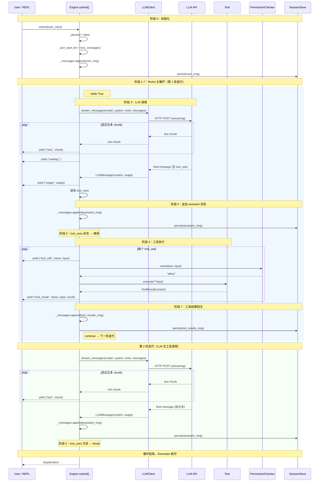

# cc-mini 执行主循环详解

## 1. 主循环定位

- **文件**：`src/core/engine.py`
- **方法**：`Engine.submit(user_input: str | list) -> Iterator[tuple]` (L234-365)
- **性质**：**同步 Generator**（非异步、非事件驱动）

`submit()` 是唯一的主循环入口。它是一个 Python Generator 函数，通过 `yield` 逐步向调用方发射事件，调用方（`main.py:run_query()`）以 `for event in engine.submit(...)` 消费。整个执行过程运行在单一线程中，所有 I/O（HTTP 流式、工具执行）均为同步阻塞调用。

---

## 2. 逐步执行流程说明

### 阶段 0：初始化（L247-253）

| 步骤 | 操作 | 代码位置 |
|------|------|----------|
| 0.1 | 重置中止标志 `_aborted = False` | L247 |
| 0.2 | 记录回滚锚点 `_turn_start_len = len(_messages)` | L248 |
| 0.3 | 将用户输入归一化后追加到 `_messages` | L249-252 |
| 0.4 | 持久化用户消息到 SessionStore | L253 |

**输入**：`user_input` — 纯文本字符串或包含图片块的 `list[dict]`。

**状态更新**：`_messages` 增加一条 `{"role": "user", "content": ...}`。

---

### 阶段 1：进入主循环 `while True`（L256）

每次迭代代表一轮"调用 LLM → 可能执行工具"的完整交互。

---

### 阶段 2：中止检查（L257-258）

在每轮循环开头检查 `_aborted` 标志。如果用户在上一轮工具执行期间按了 Esc，此处抛出 `AbortedError`。

---

### 阶段 3：LLM API 调用（L260-329）

#### 3.1 重试循环

```
for attempt in range(3):     # 最多 3 次尝试
    try:
        调用 LLM...
        break                # 成功则跳出重试
    except 认证错误:
        弹出用户消息, yield error, return
    except 可重试错误:
        sleep(1s / 3s / 10s), continue
    except 其他 API 错误:
        弹出用户消息, yield error, return
    except AbortedError:
        raise                # 直接上抛
```

#### 3.2 流式请求

```python
with self._client.stream_messages(
    model, max_tokens, system, tools, messages, effort
) as stream:
```

传入的参数：

| 参数 | 来源 | 说明 |
|------|------|------|
| `model` | `self._model` | 如 "claude-sonnet-4-20250514" |
| `max_tokens` | `self._max_tokens` | 模型最大输出 token |
| `system` | `self._system_prompt` | 动态组装的系统提示词 |
| `tools` | `[t.to_api_schema() for t in self._tools.values()]` | 所有注册工具的 JSON Schema |
| `messages` | `self._messages` | 完整对话历史 |
| `effort` | `self._effort` | 推理强度（仅 O1/O3 使用） |

#### 3.3 流式消费

```python
for text in stream.text_stream:     # L277 — 逐 chunk 迭代
    if self._aborted: raise          # L278-279 — 每个 chunk 检查中止
    yield ("text", text)             # L281 — 实时推送文本给 REPL
```

- 每个 `text` chunk 立即 yield，REPL 实时打印
- 流结束后，若产生过文本，yield `("waiting",)` 信号（L286-287）

#### 3.4 获取完整响应

```python
final = stream.get_final_message()   # L289 — LLMMessage 对象
```

返回的 `final.content` 是一个 `list[dict]`，可能包含：
- `{"type": "text", "text": "..."}` — 文本块
- `{"type": "tool_use", "id": "...", "name": "...", "input": {...}}` — 工具调用块

#### 3.5 用量追踪

```python
if final.usage and self._cost_tracker:
    self._cost_tracker.add_usage(...)     # L292-298
    yield ("usage", final.usage)          # L299
```

#### 3.6 提取工具调用

```python
tool_uses = [b for b in final.content if b["type"] == "tool_use"]   # L300-302
```

---

### 阶段 4：追加 assistant 消息（L335-339）

```python
self._messages.append({
    "role": "assistant",
    "content": _normalize_message_content(final.content),
})
self._persist(self._messages[-1])
```

**状态更新**：`_messages` 增加一条 assistant 消息，立即持久化。

---

### 阶段 5：终止条件判断（L341-342）

```python
if not tool_uses:
    break     # ← 循环终止：LLM 没有请求任何工具调用
```

**终止条件**：当 LLM 的响应中不包含任何 `tool_use` 块时，循环结束。这意味着 LLM 认为任务已完成（或已给出最终回答）。

---

### 阶段 6：工具执行（L344-356）

```python
tool_results = []
for tool_use in tool_uses:           # 逐个执行（串行）
    if self._aborted: raise           # 每次执行前检查中止
    yield ("tool_call", name, input)  # 通知 REPL："即将执行工具"
    result = self._execute_tool(tool_use)  # 实际执行
    yield ("tool_result", name, input, result)  # 通知 REPL："执行完毕"
    tool_results.append({
        "type": "tool_result",
        "tool_use_id": tool_use_id,
        "content": result.content,
        "is_error": result.is_error,
    })
```

#### 工具调用的决策机制

工具调用的决策完全由 LLM 做出。Engine 不做任何路由或过滤：

1. LLM 在 system prompt 中看到所有工具的 `name`、`description`、`input_schema`
2. LLM 自主决定是否调用、调用哪个、传什么参数
3. Engine 只负责执行 LLM 的决策

#### `_execute_tool()` 内部流程（L367-405）

```
查找工具 → 权限检查 → 执行 → 返回结果

_execute_tool(tool_use):
  tool = self._tools.get(name)        # L370 — 从注册表查找
  if tool is None:
      return ToolResult(error)        # 未知工具 → 错误

  if permissions.check(tool, input) == "deny":
      return ToolResult(error)        # 权限拒绝 → 错误

  result = tool.execute(**input)      # L389 — kwargs 展开调用
  return result                       # ToolResult(content, is_error)
```

权限检查不会阻塞循环——用户拒绝时返回 `ToolResult(is_error=True)`，LLM 在下一轮看到错误后自行调整策略。

---

### 阶段 7：工具结果回注（L358-362）

```python
self._messages.append({
    "role": "user",
    "content": _normalize_message_content(tool_results),
})
self._persist(self._messages[-1])
```

**状态更新**：`_messages` 增加一条 `role=user` 的消息，其 content 是 `tool_result` 块列表。

**然后 `continue`**，回到 阶段 1（`while True` 循环顶部），带着工具结果再次调用 LLM。

---

### 阶段 8：异常处理（L363-365）

```python
except AbortedError:
    self.cancel_turn()    # 回滚 _messages 到 _turn_start_len
    raise                 # 上抛给 run_query() 的 try/except
```

`cancel_turn()` (L222-232) 删除本轮追加的所有消息，恢复到用户输入前的状态。

---

## 3. 循环逻辑伪代码

```
function submit(user_input):
    aborted = false
    turn_start = len(messages)

    # ── 阶段 0：追加用户输入 ──
    messages.append({ role: "user", content: normalize(user_input) })
    persist(messages[-1])

    try:
        # ── 阶段 1：ReAct 主循环 ──
        loop:
            if aborted: throw AbortedError

            tool_uses = []
            final = null

            # ── 阶段 3：LLM 调用（含重试） ──
            for attempt in 0..2:
                try:
                    stream = llm_client.stream_messages(
                        model       = model,
                        max_tokens  = max_tokens,
                        system      = system_prompt,
                        tools       = [tool.schema for tool in tools],
                        messages    = messages,
                    )

                    # ── 阶段 3.3：流式消费 ──
                    for chunk in stream.text_stream:
                        if aborted: throw AbortedError
                        yield ("text", chunk)

                    if had_text:
                        yield ("waiting",)

                    # ── 阶段 3.4：获取完整响应 ──
                    final = stream.get_final_message()

                    # ── 阶段 3.5：用量追踪 ──
                    if final.usage:
                        cost_tracker.add(final.usage)
                        yield ("usage", final.usage)

                    # ── 阶段 3.6：提取工具调用 ──
                    tool_uses = [b for b in final.content where b.type == "tool_use"]
                    break  # 成功，跳出重试

                catch AuthenticationError:
                    messages.pop()
                    yield ("error", "认证失败")
                    return

                catch RetryableError:
                    if attempt < 2:
                        sleep(backoff[attempt])    # 1s, 3s, 10s
                        continue
                    else:
                        messages.pop()
                        yield ("error", "重试耗尽")
                        return

                catch ApiError:
                    messages.pop()
                    yield ("error", "API 错误")
                    return

            if final == null:
                messages.pop()
                return

            # ── 阶段 4：追加 assistant 消息 ──
            messages.append({ role: "assistant", content: normalize(final.content) })
            persist(messages[-1])

            # ── 阶段 5：终止条件 ──
            if tool_uses is empty:
                break                          # ★ 循环结束

            # ── 阶段 6：执行工具 ──
            tool_results = []
            for tool_use in tool_uses:
                if aborted: throw AbortedError
                yield ("tool_call", tool_use.name, tool_use.input)

                tool = tools[tool_use.name]
                if tool == null:
                    result = ToolResult(error: "未知工具")
                elif permissions.check(tool) == "deny":
                    result = ToolResult(error: "权限拒绝")
                else:
                    result = tool.execute(**tool_use.input)

                yield ("tool_result", tool_use.name, tool_use.input, result)
                tool_results.append({
                    type: "tool_result",
                    tool_use_id: tool_use.id,
                    content: result.content,
                    is_error: result.is_error,
                })

            # ── 阶段 7：工具结果回注 ──
            messages.append({ role: "user", content: normalize(tool_results) })
            persist(messages[-1])

            # continue → 回到循环顶部，再次调用 LLM

    catch AbortedError:
        # ── 阶段 8：回滚 ──
        messages = messages[0 : turn_start]
        throw
```

---

## 4. 同步 / 异步 / 事件驱动？

**答：同步 Generator 模式。**

| 维度 | 结论 | 证据 |
|------|------|------|
| **线程模型** | 单线程同步 | 无 `async`/`await`，无 `asyncio` 导入 |
| **I/O 模型** | 阻塞 I/O | `stream_messages()` 是同步 context manager；`tool.execute()` 是同步调用 |
| **控制流** | Generator 协程（`yield`） | `submit()` 返回 `Iterator[tuple]`，调用方 `for event in engine.submit(...)` |
| **事件分发** | 无事件总线 | 事件通过 `yield` 直接推送，无注册/订阅机制 |
| **并发** | 工具串行执行 | `for tool_use in tool_uses` 顺序循环（L345） |

这种模式可以理解为**拉取式（pull-based）流式处理**：
- `submit()` 作为 Generator，每次 `yield` 后挂起
- 调用方（`run_query()`）通过 `next()` / `for` 拉取下一个事件
- 两者交替执行，形成协作式并发

唯一的真正并发发生在 Coordinator 模式下的 Worker 线程（`worker_manager.py`），但主循环本身始终是单线程同步的。

---

## 5. 时序图



---

## 6. 关键设计决策总结

| 决策 | 选择 | 影响 |
|------|------|------|
| 循环模式 | `while True` + `break` | 简洁，无需预设最大轮数 |
| 事件传递 | `yield` (Generator) | 零拷贝、惰性求值，调用方控制消费节奏 |
| 工具执行顺序 | 串行（`for` 循环） | 简化实现，避免工具间竞态 |
| 重试策略 | 指数退避 (1s/3s/10s)，最多 3 次 | 平衡可靠性与响应速度 |
| 中止检查点 | 循环顶部 + 每个 chunk + 每个工具前 | 确保用户可随时中断 |
| 错误恢复 | `cancel_turn()` 回滚至 `_turn_start_len` | 保证消息历史一致性 |
| 工具决策权 | 完全交给 LLM | Engine 是纯执行者，不做路由 |
| 权限拒绝处理 | 返回 `ToolResult(is_error=True)` | 不中断循环，LLM 看到错误后自行调整 |
